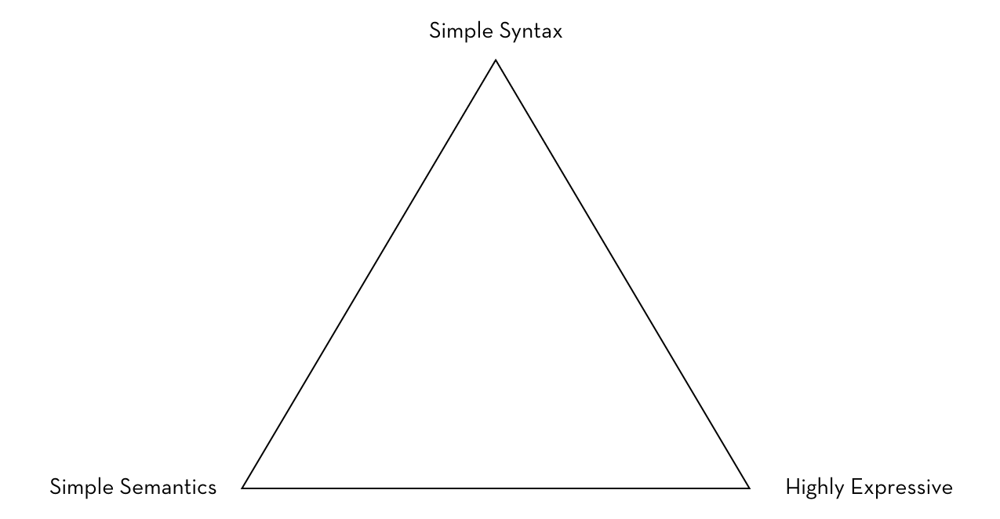

# Hoon and You - An FP Perspective

[//]: # (Version 29K)

## Introduction

_Delivered as a talk, LambdaConf 2018_

This article is about the programming language Hoon, its philosophical and technological underpinnings.

When you finish reading this, you will probably not be able to do anything in Hoon that you didn't already walk in here knowing.

But Hoon is completely unlike any other functional programming language you might know, and so we can use it to take a look at familiar concepts from a completely different angle.  Things like types.

Along the way, we'll look at programming language design and what kinds of tradeoffs go into it.

There are a lot of really smart and talented people involved in this project.  I am not one of them.  But I've had to dumb down the material to the point that I was able to understand it, and hopefully you'll be able to profit from that effort.

So, let's get to it, by first talking about what Hoon is for.

## The _Telos_ of Hoon

Much as C was developed to write Unix, Hoon was developed to write Urbit.  So we should first mention in passing what this Urbit thing is.

Urbit is the somewhat ambitious project of condemning all computing as we know it to complete obsolescence.  It's a clean-slate system software stack, which includes the following:

- OS
- networking
- security
- typed file system with built-in version control
- identity management
- addressing
- several dozen other things

And when I say "clean-slate", the operating metaphor has been to imagine they find a spaceship from Mars crash-landed outside of Bozeman, MT.  What kind of software would they be running?  (Spoiler: probably not Windows ME.)

There's not a single assumption about how computer systems should work that has not been revisited.

If you stop occasionally and ask, "Why did they do it that way?", it's a very rewarding project to study.  Although this can lead you into a rabbit hole.

## Kelvin Versioning

For instance, they use something called "Kelvin versioning".  Instead of versions increasing, they decrease, toward zero.  They use this for Hoon as well as Nock, the lowest level language, which we'll discuss shortly.

Why is this?  Why not just increment versions like everyone else does?

The answer is, because software improvement is usually considered an additive process.  Version 2.0 does more stuff than version 1.0, version 2.1 is a lot like version 2.0, except it works better.  We can assume there will be a version 3.0 sometime in the future which will work differently in some fundamental way, hopefully better but often not.

Usually this is sensible.  We launch software in an environment of uncertainty.

As time goes on, we understand the problem space better, our users gain some sophistication, technology changes, so we refine the software to match our better understanding.

Or sometimes decisions come straight from marketing.

> _CloudTron v4_
> - Now with Blockchain!
> - Add a rich, smoky bacon scent to all your cloud-stored files.

## JSON

But why do we assume that progress means change?

Take JSON.  JSON is designed for packaging data as text to send between clients and servers.  And by design, it has barely changed since the moment it came out.  

I can imagine my great-grandchildren using JSON that looks exactly like the JSON I use.  Which means, if I need to send out data from a server I'm writing, if I use JSON, whatever else I might have to change or update or fix, the actual format the data goes out in will not change at all.  

So maybe I might want to do things differently.  Personally, I'd allow an optional trailing comma at the end of arrays.

But any minor improvements you might now make to JSON have to be weighed against the immense convenience of having this entire part of your code that never has to change.  

Whatever else you might need in CloudTron v.5, it won't need to support a new version of JSON.

And that's just the problem of formatting data as text.

Now imagine the language, the libraries, the network stack, the entire OS never changes.  Imagine never being in dependency hell because everything you're working with is effectively "done" except this app you just had an idea for.

So to pull ourselves out of this rabbit-hole, maybe sometimes the ideal solution to a problem is software that _stops_ changing.  You define its scope as something achievable, and "progress" means decreasing the number of things that have to change, because everything else is working like it's supposed to.

In other words, it's being frozen.  Hence, Kelvin versioning.  We assume some Platonic ideal solution, set that version to 0K, and our versions are getting ever closer this ideal.  

### Simplicity

To make a software system that can be frozen, it has to be simple.  

You have to be ruthless in your pursuit of simplicity.  You have to make hard and fast choices about what is or isn't in scope.  If it's not in scope, do the absolute minimum you can with it.  

This way, once you do tackle this bit of functionality, you'll have the most options available to you.

This is a solution to the (Law of Leaky Abstractions)[https://www.joelonsoftware.com/2002/11/11/the-law-of-leaky-abstractions/]:

> If there's no functionality to abstract away, there's nothing to leak.

Ultimately, you can build something simple from something else that's simple.  You cannot build something simple from something complex.  

The best you can hope for is to find a way to shift some of the complexity away from some users, at the cost of making things vastly more complicated for other users.

Maybe you'll end up with a simple, elegant front-end and a nightmarish back-end.  Or vice versa.

### Nock

So what is the simplest basis for a computing system that can be frozen?  

The Urbit answer for this is Nock.  Here' is Nock 4K.  Functional assembly language:

```
A noun is an atom or a cell.  An atom is a natural number.  A cell is an ordered pair of nouns.

nock(a)             *a
[a b c]             [a [b c]]

?[a b]              0
?a                  1
+[a b]              +[a b]
+a                  1 + a
=[a a]              0
=[a b]              1
=a                  =a

/[1 a]              a
/[2 a b]            a
/[3 a b]            b
/[(a + a) b]        /[2 /[a b]]
/[(a + a + 1) b]    /[3 /[a b]]
/a                  /a

#[1 a b]            a
#[(a + a) b c]      #[a [b /[(a + a + 1) c]] c]
#[(a + a + 1) b c]  #[a [/[(a + a) c] b] c]
#a                  #a

*[a [b c] d]        [*[a b c] *[a d]]

*[a 0 b]            /[b a]
*[a 1 b]            b
*[a 2 b c]          *[*[a b] *[a c]]
*[a 3 b]            ?*[a b]
*[a 4 b]            +*[a b]
*[a 5 b]            =*[a b]

*[a 6 b c d]        *[a 2 [0 1] 2 [1 c d] [1 0] 2 [1 2 3] [1 0] 4 4 b]
*[a 7 b c]          *[a 2 b 1 c]
*[a 8 b c]          *[a 7 [[7 [0 1] b] 0 1] c]
*[a 9 b c]          *[a 7 c 2 [0 1] 0 b]
*[a 10 [b c] d]     *[a 8 c 7 [0 3] d]
*[a 10 b c]         *[a c]
*[a 12 [b c] d]     #[b *[a c] *[a d]]

*a                  *a
```

It is very, very simple.

The data model is:

```
A noun is an atom or a cell.  An atom is any natural number.
A cell is any ordered pair of nouns.
```

Basically a noun is a binary tree whose leaves are numbers, unsigned integers of arbitrary length.  Someone described the noun as an "S-Expression without the S", since Nock takes no interest in what the atom is.

```
nock(a)             *a
```

This line notes that nock is a function, which makes sense, this being functional assembly language and all.

The primary instructions:
```
*[a 0 b]            /[b a]
*[a 1 b]            b
*[a 2 b c]          *[*[a b] *[a c]]
*[a 3 b]            ?*[a b]
*[a 4 b]            +*[a b]
*[a 5 b]            =*[a b]
```

We have our instructions for comparing two values, determining if a noun is a cell or just an atom, binary tree addressing, making a constant.  

Since it's homoiconic, so there's an `apply` instruction.

And there's one &ndash; count 'em! &ndash; math instruction, increment.

Now, as anyone who's read _The Little Schemer_ can verify, all arithmetic can ultimately be derived from the increment operation.  It will be slow as hell, especially once you start doing division or matrix arithmetic, but it's possible.

Here's how to decrement in Nock:
```
[8 [1 0] 8 [1 6 [5 [0 7] 4 0 6] [0 6] 9 2 [0 2] [4 0 6] 0 7] 9 2 0 1]
```

By having one math operation in Nock, we have explicitly taken speed and performance out of scope.  This has to be solved at some point, but we're accepting it's not going to be solved here.

```
*[a 6 b c d]        *[a 2 [0 1] 2 [1 c d] [1 0] 2 [1 2 3] [1 0] 4 4 b]
*[a 7 b c]          *[a 2 b 1 c]
*[a 8 b c]          *[a 7 [[7 [0 1] b] 0 1] c]
*[a 9 b c]          *[a 7 c 2 [0 1] 0 b]
*[a 10 [b c] d]     *[a 8 c 7 [0 3] d]
*[a 10 b c]         *[a c]
*[a 12 [b c] d]     #[b *[a c] *[a d]]

```
[//]: # (*)

Instructions 6 through 12 are macros.  We have our instructions for function composition, if-then-else, and editing a noun.

And that's it.  Those are all the instructions.  And much like building all of math from increment, we build all of computing from these operations.

There is some overlap with Lambda Calculus in its most stripped-down form, but this is not Lambda Calculus.

### Nock Tradeoffs

Nock is not the simplest basis for computing.  If it were, it wouldn't have macros, for starters.  It's striving for the simplest basis of computing that is actually useful.

We want macros, because we know we're going to have to do if-then-else, and it helps immensely if we know, at a glance, that this is what we're looking at, rather than having to infer it from a pile of comparisons and nested `apply` statements.

The only primitive data type is an unsigned integer.  Nock will treat all values like placeholders.  What they _mean_ will be handled in Hoon.

The only data structure is a binary tree.  This is not the simplest data structure you could pick.  Brainf\*ck uses a single array, which I would argue is way simpler.  But if you're shooting for maximal power with minimal complexity, you really can't do better than a binary tree.

On top of those, here's what else Nock does not have:

- Variables
- Functions
- An environment
- A syntax
- Error handling of any kind 

## Hoon

Okay, with that background, we are finally in a position to look at Hoon.

Hoon is the higher-level language of Urbit.  It is statically typed and compiles down to Nock, which is then interpreted.  

Hoon is intended to be a systems language.  It's designed to be good at compiling, running, and reloading programs at runtime.

It can hot-reload an app, a kernel module, or the whole OS just by running a function on an incoming packet.

The compiler for Hoon is written in Hoon.  Please don't ask how this is
possible.

It also uses Kelvin versioning.  Its version is 143 and it's still in active development, but it is intended to be frozen.  

So, like Hoon, it strives for simplicity, in its relationship to Nock, in what the compiler is doing, and in its semantics.  

### Hoon's Terrifying Syntax

Hoon programs are composed of `hoon`s, which are abstract syntax trees.

Hoon expressions begin with a rune, which is a pair of ASCII characters, like `|=`.  The runes are followed by one or more sub-expressions, which might be (and often are) Hoons themselves.

Given the ASCII-heavy nature of Hoon, there's a handy set of nicknames for each ASCII character you might use.

```
ace [1 space]   gal <               pal (
bar |           gap [>1 space, nl]  par )
bas \           gar >               sel [
buc $           hax #               sem ;
cab _           hep -               ser ]
cen %           kel {               sig ~
col :           ker }               soq '
com ,           ket ^               tar *
doq "           lus +               tec `
dot .           pam &               tis =
fas /           pat @               wut ?
zap !
```

It's not entirely necessary to memorize this, but it will make it more likely your dreams will come true.

Using these runes, you can actually speak Hoon code out loud.

### Demo App

So, here's my favorite "Introduction to FP" example program, which takes some number `n` and prints the first `n` numbers in the Fibonacci sequence.

```
|=  n/@ud                       :: 1
^-  (list @ud)                  :: 2
=/  a  0                        :: 3
=/  b  1                        :: 4
|-                              :: 5
:-                              :: 6
  a                             :: 7
?:  =(0 n)                      :: 8
  ~                             :: 9
$(n (dec n), a b, b (add a b))  :: 10
```

First we create a "gate", which is approximately a function (line 1).

Line 2 casts the results to a list of unsigned decimals.

We define a couple of variables (line 3, 4).

Line 5 sets our recursion point (more or less).

On line 6, `:-` or `colhep` means we're doing a `cons` to create a cell.  The head of our cell, on line 7, is `a`.

If our `n` is zero (line 8), we append a null to the list (line 9).  The tilde,
or `sig` is the null value in Hoon.

Otherwise, we recurse with updated values (line 10).

`n` is decremented, `a` is set to `b`, and `b` is the sum of the previous `a` and `b`.

(Actually, the director's cut description of what's going on here is that line 4 creates a function named `$` (i.e. an anonymous function), whose contents are the rest of this program.  This function also gets called immediately.

Then on line 10, we call this function again, giving it a list of all the changes we've made.)

### Hoons

Each rune in Hoon is expecting certain sub-expressions.  Hoon eschews Lisp-style enclosing parentheses, so your code is mercifully free of terminator piles, like `)))))))))`.

The tradeoff here is that you have to know what sub-expressions the compiler will be expecting, and you have to know where one Hoon ends and another one begins.

You can generally clarify things through good use of style and indentation.  

As an example, if you need to create a cell, you use the `:-` rune.  This is formally defined as:

```
{%clhp p=hoon q=hoon}
```

The `hoon`s in this definition, `p` and `q`, can be another value or the result of another Hoon.  If you're making a cell of two values, you would write:

```
:-  42  420
```

Or these `hoon`s could be more complicated than that.  In the case of our sample app, we `cons` the next Fibonacci number with the results of our `if` rune, (i.e. `?:` or `buccol`).

```
:-                              :: 6
  a                             :: 7
?:  =(0 n)                      :: 8
  ~                             :: 9
$(n (dec n), a b, b (add a b))  :: 10
```

Other runes are usually used differently.  One way to "declare a variable" is to use the `=/` or `tisfas` rune.  

In our sample app, we see this one used as:
```
=/  a  0                        :: 3 
=/  b  1                        :: 4
|-                              :: 5 
...
```

This rune is defined as:
```
{$tsfs p/toro q/hoon r/hoon}
```

(The type for `p` is `toro`, which is defined as a label and an optional type.)

In our app on line 2, the `p` is `a`, our variable name.  `q` is the value we're setting it to, i.e. zero.  

And what's `r`?  `r`, in this case, is the rest of the program.  

You'll find that many runes are defined so that the last argument can be the rest of the program, such as the rune to cast to a type, `^-`, or to restrict the Hoon version, `!?`. 

These sorts of runes help give Hoon a procedural feel.  In practice, Hoon is 100% a functional language, but you can lay your code out so that it reads like a sequence of actions.  

Maybe it's because I spent some of my crucial formative years doing turtle graphics, but this maps well to how my brain works.

Well-styled Hoon should flow this way.  If you have an if statement, `?:`, and you find that most of the "meat" happens when the test is `true`, use the inverted test, `?.`, so the `true` clause happens last.

I think of style as "soft syntax".  It's syntax that doesn't have to be formalized to the point that something as stupid as a compiler can handle it.  It's syntax you can ignore if you have a good reason.  And you can change style without having to push out a new version.  

### The Subject

Every operation is evaluated against one operand, the `subject`.  It will return one result, the `product`.  

There's no "environment" or "scope".  There's no symbol table.  Just the subject.

The subject, by default, contains the standard libraries, info about the ship we're running this on.  But we can always add things to the subject, and explicitly choose a limited subset of the subject to work with.  

### Digression #1 - Language Tradeoffs

I described the syntax for Hoon as "terrifying", and I'm sticking with it.  I think most Hoon developers would agree.

Syntax here means, what do you have to type out to do the thing you're trying to do?  How wordy and complicated is it?

This is in contrast with semantics which means, what do the things you're typing out mean?  Conceptually, how easily can this fit into your head?

Another way to look at it is that syntax is the front-end, the thing the developer types in.  Semantics is the back-end, what the machine is capable of doing with it?

In any language, there's a tension between syntax and semantics.  

Some poorly designed languages can have complicated syntax and complicated semantics, but at some point, simplifying the one will come at the expense of making the other more complicated.

A good example of this is static types vs. dynamic types.

Dynamic types simplify the syntax for the simple reason that you don't have to specify a type.  Something like this is perfectly valid in JavaScript:

```
thing = 23
thing = "changed my mind"
thing = 12.3
```

This comes at the expense of not exactly knowing what `thing` is.  If I start using it in some other part of the code, what value is it going to have?  Can I append a string to it?  What's that going to look like?

I'm picking on JavaScript because it's a [notorious semantic dumpster fire](https://www.destroyallsoftware.com/talks/wat).  This is because the interpreter will accept pretty much anything as valid syntax, even things that don't make any sense semantically.

Nock has very simple syntax and very simple semantics.  There's nothing that's a big secret going on here.  The problem is that, by itself, it's of extremely limited utility.  You don't have to sweat how type inference works in Nock because Nock has no types.

Which brings up the third point.  Expressiveness.  What concepts do the language make possible?  How easy is it to put these ideas into code?

So I've made a handy diagram to condense this idea.  This is the most important
diagram in this article.  I present:

##  LeBlanc's Triangle



Please note: this idea is not particularly original.  What is original is making it into a triangle shape and naming it after myself.

When you give something a triangle shape, you're saying, “Pick any two”.

Hoon has very complicated syntax but the semantics are actually fairly straightforward.  There's no magic happening inside the compiler.  If you understand the code, you pretty much understand what the compiler is doing.

However, even though the semantics are simple, they're chosen in such a way that you can express some really powerful ideas with them.

## Types

I would dearly love to run you through all the ins and outs of Hoon, but they gave me 50 minutes for a talk, and the above content used up a ton of them.  

So for the remainder, I'd like to drill a bit into types and how they work in Hoon.

Hoon is a strongly-typed language, but its type system works completely differently, and way more simply, than most other strongly-typed languages.  

Hopefully you can get a flavor of how close we can get to the fully-armed and operational bidirectional type inference system which Hindley-Milner makes possible, only with 1/1000th the complexity.

### Molds

So, let's talk about what a type actually is.  A type is a set of values which conforms to some kind of semantic criteria.  It could have infinitely many possible values or it could have zero possible values.  Or one possible value.

(Side note: what's the difference between a type with one value and a constant?
A: There isn't any.)

Conveniently enough, this definition is really close to the definition of a function.  A function takes as input some domain, does stuff, and its output is some other domain, the range.  All functional languages work like this, and Hoon is a functional language.

So for a minimalist type system, all you really need is the humble function.  You could take as the domain any value and validate that it conforms to your semantic criteria.  If it does, pass it along as-is.  If it doesn't, pass along some default value that's still part of your type domain.

Not at all coincidentally, this is how a `mold` works in Hoon, as a type constructor function.

### Atoms

As a thin layer over Nock, Hoon continues to use the `noun` as its one way of representing a value.  This certainly makes the type-constructor-as-function thing quite a bit easier, since the possible values we might want types for are numbers and binary trees of numbers.

Hoon adds a few additional bits of decoration and functionality to make everyone's life easier.

In Nock, we represented all data contents as unsigned integers, which we said was pretty useless but we'd deal with it in the future.  Well, the future is now.

So, an arbitrary-length unsigned integer is basically a collection of bytes.  So really, anything that can be represented as bytes can be an atom:

- Signed ints
- Unsigned ints
- Floats
- Strings
- Bitcoin wallet
- Animated gifs
- The genome for the naked molerat
- A cracked copy of Duke Nukem II

If we know what our atom represents, we can assign a soft type, or an `aura` to it.  All but the last three on this list are valid atoms, by the way, including the bitcoin wallet.

Auras specialize to the right:
```
@ => any atom
@t => UTF-8 text (a `cord`)
@ta => ASCII text
@tas => ASCII text symbol (lowercase letters and digits only)
```

Auras are truly soft types.  Underneath it all, they're still just integers, and you can convert any aura to any other aura, if you first convert it to `@`.

```
@c    UTF-32                   ~-foobar
@da   128-bit absolute date    ~2016.4.23..20.09.26..f27b..dead..beef..babe
                               ~2016.4.23
@dr   128-bit relative date    ~s17          (17 seconds)
                               ~m20          (20 minutes)
                               ~d42          (42 days)
@f    loobean                  &             (0, yes)
                               |             (1, no)
@p                             ~zod          (0)
@rs   32-bit IEEE float        .3.14         (pi)
                               .-3.14        (negative pi)
@sd   signed decimal           --2           (2)
                               -5            (-5)
@ub   unsigned binary          0b10          (2)
@uc   bitcoin address          0c1A1zP1eP5QGefi2DMPTfTL5SLmv7DivfNa
@ud   unsigned decimal         42            (42)
                               1.420         (1420)
@ux   unsigned hexadecimal     0xcafe.babe
```
_A non-exhaustive list of auras and their associated literals._

The syntax for our data literals is a bit complicated for two reasons:
1. They're designed to be URL-safe
2. They all have different parse rules

This is an example of the tradeoff between syntax and semantics.  Once you know the rules for what a float looks like &mdash; `=/  pi .3.14159` &mdash; our understanding of what kind of this number this is is exactly the same as the compiler's.

One `aura` that is unique to Urbit is `@p`, which is the phonemic base.  This is a pronounceable, base-256 representation:

```
~leb => 145
~samtul => 1066
```

So, let's take these auras for a spin.

```
> (add 70 4)
74
> ? (add 70 4)
  @
74
```
If we use `wut`, we can get the return type for this function, which is `@` or "any atom".

```
> ^-  @t  (add 70 4)
'J'
> ^-  @  'J'
74
```
We can use `^-` or `kethep` to cast the return value to `@t` or "text".  We can also go the other direction and cast 'J' back into a generic atom.

```
> ^-  @t  74
 /~ribben-donnyl/home/~2018.5.27..17.31.49..d55f/sys/vane/ford:<[1.290 24].[1.290 52]>
 nest-fail
 \/ford: build failed ~[/g/~ribben-donnyl/use/dojo/~ribben-donnyl/inn/hand
 /g/~ribben-donnyl/use/hood/~ribben-donnyl/out/dojo/drum/phat/~mall\/
   et-rilmul/dojo /d //term/1]
   \/ 
> ? 74
 @ud
74
```
If we try to cast 74 directly to text, we get a nest-fail.  When we call `wut` to see what our type is, it's `@ud`, an unsigned decimal.  

So you can make auras more specific or less specific, but you can't alter their type directly.  You can't convert from the "unsigned" type `@u` to the "text" type `@t`.

```
> `@t``@`74
'J'
```
The shorthand for casting is to use `tec`s, i.e. backticks.  We can do this conversion if we cast the `@ud` to `@` or "any atom" first, and then cast to `@t`.

```
> `@p``@`.127.0.0.1
~bidpur-hidpex
```
Here's our phonemic base in action.  All the addresses for personal IDs in Urbit are the size of an IP address.  

Here's my personal ship cast to an IP address:
```
> `@if`~ribben-donnyl
.33.165.1.0
```
`@if` is "IP v4 address".  I think the pronounceable version is more memorable, but your opinion might vary.

Finally, here's a look at signed numbers. 
```
> `@`--51
102
> `@`-51
101
```

Atoms are arbitrary-length, you can't do the usual two's complement, since there's no way of knowing how many bytes you'll need.  Instead, the sign bit is the lowest bit.   Positive `n` is `n*2`, negative `n` is `n*2-1`.

### Faces

In Nock, we have one operation to extract data from our binary tree, which is to give it an address.

1 is the address for the whole tree, 2 is the address for the left subtree, 3 is for the right subtree, etc.


In Hoon, we can add label these nodes, which are called "surfaces" or just "faces".  To get some node or subtree out of a noun, you give it a face and Hoon performs a depth-first search and returns the first element it finds.

Using these faces, you can make your noun work like an associative array, or dictionary, or hash table, or whatever your language calls them.


There is no symbol table in Hoon.  Just a depth-first search.

### Unions

Hoon has the equivalent of the `Either` type, only better!  You are not limited to a `Left` and `Right`.  You can declare a type that is a union of an arbitrary number of other types.

One of these union types is `unit`, which works like a `Maybe`, or an `Option`, or a `Possibly`.

This has two acceptable values, either the null value, `$~`, which means `Nothing`, or `None`.  Then there's `[~ a]`, which means either `Just a` or `Some a`.

And in case anyone is wondering, the Hoon standard library supplies the axiomatic Monadic functions, `bind` and `just`, which Haskell calls `return`.

### Typechecking

In Urbit, typechecking is called `nest`-ing.  So, a type is a set of values.  And a type check verifies that this type's set of values "nests" inside some other type's set of values?  Is it a subset?

Say we want a type to represent a dog.  I mentioned we can use faces and make an associative array.  So let's do that.

```
> =dog {name/@t color/@ta date-of-birth/@da}
```

Urbit comes with a built-in Hoon REPL.  It's got some non-standard features,
like this `=dog`, which creates a variable called `dog`.  And `dog` is a type,
with three labeled attributes, a `name`, which is any UTF-8 text, a `color`,
which is limited to ASCII, and date of birth, which is an absolute date.

```
> =bruno [name='Bruno🐶' color='faun' date-of-birth=~2016.12.10]
> ? bruno
  {name/@t color/@t date-of-birth/@da}
[name='Bruno🐶' color='faun' date-of-birth=~2016.12.10]
```
We make another variable called `bruno`.  

Using the `?` or `wut` here, we can verify Bruno's type.  We didn't declare Bruno with any reference to our `dog` type, but he's got the same tree "shape", faces, and compatible auras.

```
> ?? bruno

  [ %cell
    [%face [~ %name] [%atom %t ~]]
    [ %cell
      [%face [~ %color] [%atom %ta ~]]
      [%face [~ %date-of-birth] [%atom %da ~]]
    ]
  ]
[name='Bruno🐶' color=~.faun date-of-birth=~2016.12.10]
```

We can all do a `wutwut`, to see Bruno's uncensored type, its type as a noun.

Internally, this type is composed of several subtypes, for cells, faces, atoms, etc.

```
> `dog`bruno
[name='Bruno🐶' color=~.faun age=~2016.12.10]
```
We attempt to cast bruno as a dog.  Bruno is, in fact, a valid dog.  

Let's make another dog, called `rex`, with a completely invalid date of birth.

```
> =rex [name='rex' color='hairless' dob=42]
> `dog`rex

/~ribben-donnyl/home/~2018.5.27..17.31.49..d55f/sys/vane/ford
  <[1.290 24].[1.290 52]>
nest-fail
\/ford: build failed ~[/g/~ribben-donnyl/use/dojo/~ribben-donnyl/inn/hand /g/\/
  ~ribben-donnyl/use/hood/~ribben-donnyl/out/dojo/drum/phat/~ribben-donnyl/do
  jo /d //term/1]
\/
```
When we try to cast `rex` as a dog, we get a `nest-fail`.  `rex` is a bad dog.

I mentioned that molds are functions.  You can actually call them and provide them with a sample.  If the sample is of the correct type, it will return the sample.  If it isn't, it will return a default value.

You don't usually do this directly.  Usually the compiler takes care of types for you.  But you can if you want to validate untrusted network traffic, for instance.

So let's say we have a service that accepts a dog as input.  

```
> (dog bruno)
[name='Bruno🐶' color=~.faun date-of-birth=~2016.12.10]
```
We call `dog` with `bruno`, and we get back `bruno`.

```
> (dog 17)
[name='' color=~. date-of-birth=~292277024401-.1.1]
```

We call `dog` with a silly value, we get back a dog with all its values filled
with defaults.

So the mold doesn't necessarily give you back the value that was sent over the wire.  But it doesn't give you something malformed or malicious either.

```
> (dog rex)
[ name='rex'
  color=~.hairless
  age=~292277024401-.1.1..00.00.00..0000.0000.0000.002a
]
```

If we call it with `rex`, it returns a valid `dog` and it converts `rex`'s weird date of birth to a valid absolute date.

Since nouns in Hoon are atoms, trees, and node labels, for the developer, figuring out the "type" of a value is often a matter of pattern matching.  In Hoon this uses the `?=` or `wuttis` rune.
```
> ?=({color/@ *} bruno)
%.y
```
In this instance, we're just asking if `bruno`'s type has a node labeled `color`, which contains an atom.  The `*` means "any noun"  so we want `bruno` to have any other value to pattern match.

And `%.y` means this matches.

```
> ?=({color/* @ @ @} bruno)
%.n
```
If we asked if `bruno` has color and three more nodes, this fails.

Let's make a `cat` type.
```
> =cat {color/@ta date-of-birth/@da}
```
Unlike the `dog`, it's got two values, a color and a date of birth.  (It has no name, because it's not like if you call its name, a cat is going to come to you.)

```
> =pet $?(dog cat)
```
Now using `$?`, or `buckwut`, we make a union type, a `pet`, which is either a `cat` or a `dog`.

```
> `pet`bruno
[name='Bruno🐶' color=~.faun date-of-birth=~2016.12.10]
```
Then we try to cast `bruno` as a `pet` and it works.

### Cores

I've thrown out the word "function" many times, as you'd expect for a conference on functional programming.  However, the details are a bit more complicated than you might assume from the term "function".

Functions in Hoon appears inside a `core`, which is a cell with two parts: the code and the data.  The code takes the form of a list of compiled attributes, called `arm`s.

A `gate` is a special case, being a core with one nameless arm, i.e. a lambda.

This is a recurring pattern in Hoon.  If you can make one of something, you can also make a whole list of something, and the one-of-something is a special case.  

Cores serve the same function as objects in most other languages, since they contain both methods and data.

(Side note: "Nameless Arm" would make a pretty good album name)

## Mint

Types are only really important within the context of a function.  What sorts of values can this function handle as input, and what sort of values is it going to return?

In Hoon, you do not declare a type.  They're only inferred by the compiler.  You pass code to the compiler and it returns a pair of a type and Nock code.

Type inference in Hoon only happens forwards, not backwards.  Which means the compiler will determine the return value of a function, but won't figure out the types of the function arguments.

This means that, since you can't rely on the compiler to figure out all your types, you have to annotate them.  Although this arguably makes your code more readable.

Sometimes, you might choose to annotate where it isn't technically needed.   Looking at our Fibonacci program from above:
```
|=  n/@ud                       :: 1
^-  (list @ud)                  :: 2
=/  a  0                        :: 3
=/  b  1                        :: 4
|-                              :: 5
:-                              :: 6
  a                             :: 7
?:  =(0 n)                      :: 8
  ~                             :: 9
$(n (dec n), a b, b (add a b))  :: 10
```

On line 2, we cast the results of everything that follows to a list of unsigned decimals.  Since this is the first line in this function, this will end up the inferred type for this whole program.

This does a few things:

1. It documents exactly what we're trying to do here.  
2. If this isn't giving us the type we think it should, we'll get a type error, a `nest-fail`, right there at line 5, rather than somewhere else in the app.

This applies to pretty much any language.  Just because the compiler will infer what you're doing, unless you're doing something explicitly generic, it won't kill you to type out what you're expecting and can save you some trouble.

As it happens, if you leave out the cast, the inferred type is almost a list of unsigned decimals... but not exactly. The compiler tends to err toward being too generic and it can drop information you might be expecting.

You can end up with really subtle bugs if you just let the compiler do all the work for you.

So here's a function to make a tuple, an arbitrary-length list:
```
> :+(42 420 %gocards)
[42 420 %gocards]
```

We can call the parser from the command line:
```
> =parsed (ream ':+(42 420 %gocards)')
> parsed
[%clls p=[%sand p=%ud q=42] q=[%sand p=%ud q=420] r=[%rock p=%tas q=32.480.064.744.681.319]]
```

Then we can pass this parsed expression to the compiler:
```
> (~(mint ut %noun) %noun parsed)
[#t/{@ud @ud $gocards} q=[%1 p=[42 420 32.480.064.744.681.319]]]
```

The `q` is our compiled Nock code.  And the `#t` is our type, which says, as we were expecting, it's a tuple with two unsigned integers and a constant, gocards.

(Go Cards!)

### Polymorphism

We don't want to have to write a different function for every type if we don't
have to, and we don't have to in Hoon through the magic of polymorphism.  

What we've been describing is, in Hoon terms, "dry polymorphism", or "variance".   This uses Liskov substitution, which is the same type checking we were using above when we were talking about auras and dogs.  

However, we're leaving a whole lot of tasty functional goodness if we don't talk about the other sort of polymorphism, "wet polymorphism" or "genericity".

When we use wet gates, our code is compiled, but we defer doing our full type inference until we actually use the function.  Then we infer the type based on the inputs we are given.  So the function acts something like a macro.

So, here's a very simple function that will work for pedagogic purposes.
```
|=  p/(list *)  :: 1
|-              :: 2
?~  p           :: 3
  ~             :: 4
:-  i=i.p       :: 5
t=$(p t.p)      :: 6
```

This program accepts a list and recursively rebuilds the same list. 

```
> `(list *)`(limo ~[1 2 3])
~[1 2 3]
```
`limo` will take a null-terminated tuple and make a `list` out of it.

```
> +rebuild (limo ~[1 2 3])                                           
~[1 2 3]
```

So far so good.  Now, what if we use a `tape`, which is a string represented as a list of characters?

```
> +rebuild "tape"
~[116 97 112 101]
```

This is not what we wanted!

The problem is, when this compiled as a dry gate, it set the type of the `list` to `*`, which is "any noun".  Then when we call it, it casts the characters in our string to their raw ints and that's what we build a list out of.

```
|*  p/(list)    :: 1
```

So we change our `|=`, which makes a dry gate, to a `|*`, which makes a wet gate.

```
> +rebuild "tape" 
"tape"
```
And when we run it, we get our string back.

The standard library uses wet gates for things like folds, maps, and the sorts of things you might use a typeclass for in Haskell.

## And That's All for Now

At this point, I would dearly love to launch into a discussion on how cores work, some of the more interesting details on type inference, and the menu of options for polymorphism open to you.  It's got a much more extensive menu of options so much more than wet vs. dry.

However, that's all we have time for.  However, I will be happy to discuss cores, type inference, and polymorphism with everyone at LambdaConf 2019.

## Conclusions

So, here's what I'm hoping everyone takes away from this, even if they never
look at anything Urbit-related ever again:

- The amazing possibility of computing based on nothing but unsigned integers, binary trees, and increment.

- ASCII Pronunciation

Give it a try!  You'll find coding to be a different experience when you can
subvocalize what you're typing out.  

- Kelvin Versioning

I think Kelvin versioning would work well with a REST endpoint that's under development.  You might have some other developers who are also developing a client to consume your data, and giving your return value a Kelvin version lets them know how close you are to being "done" and if something has changed.

- LeBlanc's Triangle


I'm serious about that one.  Spread the word on that.  Work it into conversation with your friends and in-laws.  Don't forget to call it "LeBlanc's Triangle".

If that takes off, you can be a total hipster about it and say, "Yeah, I was there at the conference when the eponymous LeBlanc introduced it."

Really, everyone's a winner on that.

And finally, to quote the Urbit whitepaper: 

> _"Urbit is cool and you should check it out."_

This is a good time for that.  After this latest version of Hoon, development is being transitioned out of "auteur" mode and handed over to the developer community.  

Hoon makes no use of category theory.  Should it?  What are we missing without it?  Get involved and make the system better.

## Some Links

[Install Urbit](https://urbit.org/docs/using/install/) and have a look.

Then [check out the stream](https://urbit.org/stream/).  You can chat with people, possibly myself, and pepper everyone with questions.

If you see `~ribben-donnyl` on there, that's me.  Say hello!

Also, you might have seen me walking around with a variety of cool Urbit shirts.
[They're available for purchase.](http://urbit.threadless.com)

## Acknowledgments

- Ted, Mark, and everyone at Tlon
- Josh Reagan at Rice
- WWT Asynchrony Labs - [We're hiring](https://www2.wwt.com/careers/)!  Openings in St. Louis and Denver.
